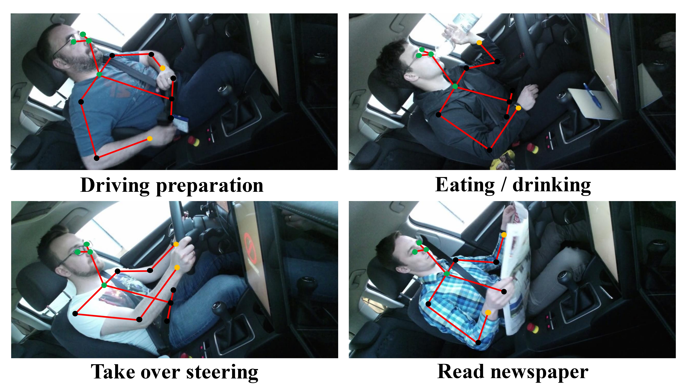

<div align="center">
<h1> Do You Act Like You Talk? Exploring Pose-based Driver Action Classification with Speech Recognition Networks </h1>


Pablo Pardo-Decimavilla</a><sup><span>1</span></sup>, 
Luis M. Bergasa</a><sup><span>1</span></sup>,
Santiago Montiel-Marín</a><sup><span>1</span></sup>,
Miguel Antunes</a><sup><span>1</span></sup>,
Ángel Llamazares</a><sup><span>1</span></sup>,
</br>

<sup>1</sup> Electronics Departament, University of Alcalá (UAH), Spain.
<br>
<div>



</div>
</div>

# Replicate paper results

Follow the steps to replicate the paper results.

## Run the docker container:

Build and run the docker container to replicate the same experimental setup.

> Requires docker engine and nvidia docker for GPU training and evaluation.


```bash
cd docker
docker compose build
docker compose run --rm dyalyt_container
```

## Prepare the dataset

To train the model on [**Drive&Act**](https://driveandact.com/):

Download the pose data from the [official website](https://driveandact.com/). Use the [3D Body Pose](https://driveandact.com/dataset/iccv_activities_3s.zip) and the [Activities annotations](https://driveandact.com/dataset/iccv_activities_3s.zip). Move the ```activities_3s``` folder and the ```openpose_3d``` folder to the ```driveandact``` directory. Prepare the dataset with the following command:

```bash
cd driveandact
python3 prepare_aad.py --data --coarse_label
cd ..
```
> The script is based on [this repo](https://github.com/holzbock/st_mlp).<br>

This will create two pickle file one containing the skeleton (```skeleton.pkl```) and the other with the corresponding annotations (```coarse.pkl```).


## Training and Testing

The following command will train the model with the hyperparameters used in the paper. After the training the the best model will be evaluated in the test set.

### Logging with Wandb

You will be asked to add your wandb token. It will be saved in the Project named ```DYALYT``` with the specified ```run-name```.

```bash
python3 train.py --wandb <run-name>
```

### Not logging

If you do not want to log 
```bash
python3 train.py
```

# Results

Evaluation of coarse scenarios/tasks on the Drive\&Act dataset using macro-accuracy of our architecture.

| Data | Method | Validation | Test  |
|---------------|-----------------|---------------------|----------------|
| Pose    | ours   | 44.60      | 43.59 |